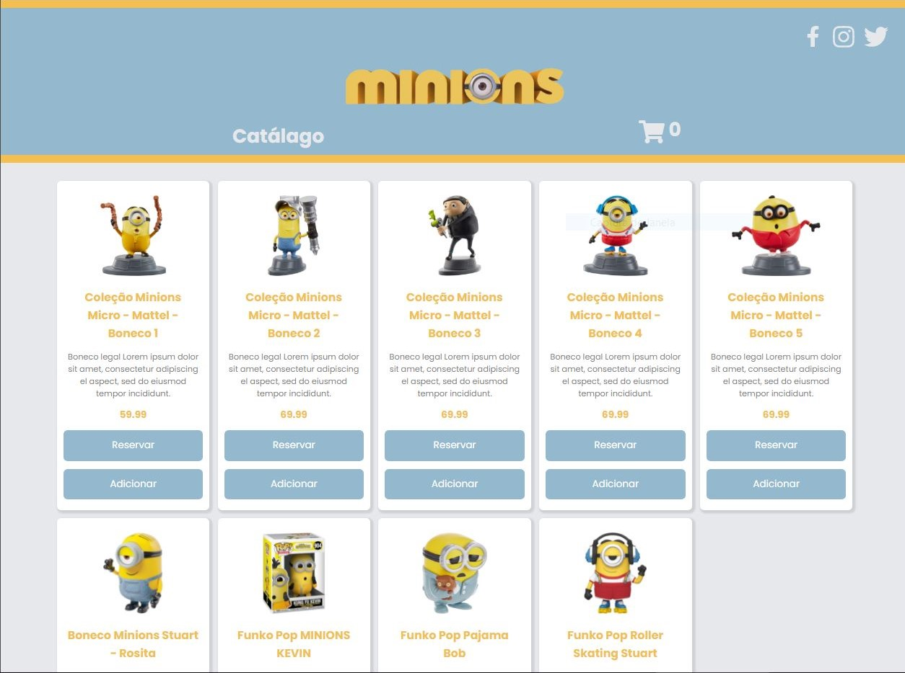
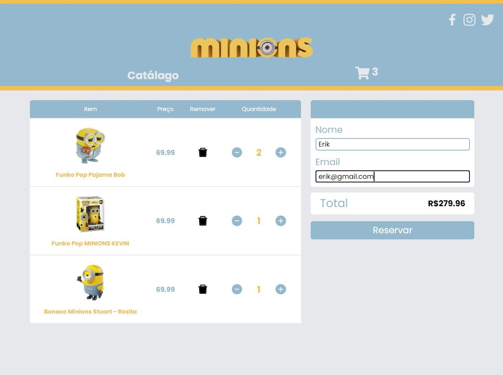

# Desafio 2 | Front-end 

<h1 align="center">
    
    
</h1>


## 📋 Sobre

O projeto foi elaborado durante o desafio BGC,contudo foi feito back e front end da aplicação.

## 🚀 Tecnologias utilizadas

- [React](https://pt-br.reactjs.org/)
- [Styled-Components](https://styled-components.com/)
- [Axios](https://github.com/axios/axios)
- [React-toastify](https://fkhadra.github.io/react-toastify/introduction)

## 👨‍💻 Como baixar

```bash

    # Clone o projeto
    $ git clone https://github.com/danileao/rocketmusic

    # Entre no diretório
    $ cd desafio-2-front

    # Instale as dependências
    $ yarn install

    # Inicie o projeto
    $ yarn start

```

### Desenvolvido por Erik Stellet

